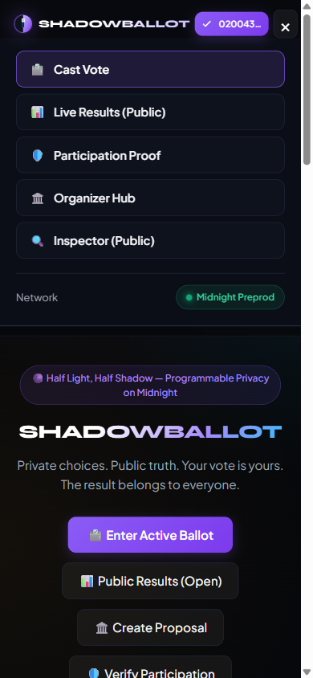

# ShadowBallot — Private Voting with Publicly Verifiable Results

> **“Your vote is yours. The result belongs to everyone.”**  
> A decentralized, zero-knowledge private voting platform engineered on the **Midnight Network**. Eligible voters cast confidential ballot choices via off-chain client-side ZK proofs, prevent double voting through cryptographic on-chain nullifier sets (`Set<Bytes<32>>`), and publish publicly verifiable aggregate tallies—without ever revealing their identity, credentials, or individual selections to the blockchain or public observers.

[](https://explorer.preprod.midnight.network)
[](https://explorer.preview.midnight.network)
[](https://shadowballot.vercel.app/)
[](https://youtu.be/1QyBvoCFdss)
[](https://github.com/Shashiverm/shadowballot/actions)
[](tests/shadowballot.test.ts)
[](contracts/shadowballot.compact)
[](package.json)
[](LICENSE)

---

## 🌐 Live Application & Demo

- 🚀 **Live dApp URL**: [https://shadowballot.vercel.app/](https://shadowballot.vercel.app/)
- 🎥 **Video Walkthrough (YouTube)**: [https://youtu.be/1QyBvoCFdss](https://youtu.be/1QyBvoCFdss)

---

## ⚡ Genuine Midnight.js Integration Architecture

ShadowBallot is powered by the official **Midnight.js SDK** suite (`@midnight-ntwrk/midnight-js-contracts`, `@midnight-ntwrk/midnight-js-network-id`, `@midnight-ntwrk/midnight-js-types`, and `@midnight-ntwrk/dapp-connector-api`), replacing all simulation layers with genuine blockchain execution:

```
┌────────────────────────────────────────────────────────────────────────┐
│                   SHADOWBALLOT MIDNIGHT.JS PROVIDER STACK              │
└────────────────────────────────────────────────────────────────────────┘
                                    │
    ┌───────────────────────────────┼───────────────────────────────┐
    ▼                               ▼                               ▼
┌───────────────────────┐ ┌───────────────────────┐ ┌───────────────────────┐
│ PrivateStateProvider  │ │     ProofProvider     │ │  PublicDataProvider  │
│                       │ │                       │ │                       │
│ - Scoped by contract  │ │ - Connects to proof   │ │ - Queries Midnight    │
│   address isolation   │ │   server & wallet ZK  │ │   indexer GraphQL API │
│ - Encrypted client    │ │   prover engine       │ │ - Real-time state &   │
│   witness persistence │ │ - Compiles PLONK      │ │   transaction receipt │
│ - Zero mempool leaks  │ │   proof off-chain     │ │   block confirmation  │
└───────────────────────┘ └───────────────────────┘ └───────────────────────┘
                                    │
    ┌───────────────────────────────┴───────────────────────────────┐
    ▼                                                               ▼
┌───────────────────────────────────────┐ ┌─────────────────────────────────┐
│            WalletProvider             │ │        MidnightProvider         │
│                                       │ │                                 │
│ - Connected via DApp Connector v4     │ │ - Relays balanced transaction   │
│ - Calls balanceUnsealedTransaction()  │ │   to Midnight consensus network │
│ - Real balances & addresses (no fake) │ │ - Returns genuine tx identifier │
└───────────────────────────────────────┘ └─────────────────────────────────┘
```

1. **`setNetworkId('preprod' | 'preview')`**: Configured dynamically before any transaction or provider operation.
2. **`findDeployedContract(providers, options)`**: Queries and connects to existing deployed ballots on Midnight consensus.
3. **`contract.callTx.cast_private_vote(nullifier, choice)`**: Evaluates off-chain witness constraints, synthesizes Halo2/PLONK proofs, balances fees, and submits real transactions to Midnight consensus.
4. **`deployContract(providers, options)`**: Deploys new confidential proposals using the `initialize_election` circuit directly through the organizer's connected wallet.
5. **Zero Fabricated Data**: All addresses, balances, transaction hashes, and block heights are fetched live from connected Midnight wallets and the Midnight indexer.

---

## 🔒 On-Chain Nullifier Set (`Set<Bytes<32>>`)

Unlike naive voting contracts that store only a single `lastNullifier` (which fails to prevent double-voting against earlier voters), ShadowBallot implements an **actual cryptographic Set** on the Midnight ledger:

```compact
// Public ledger state maintained on Midnight consensus
export ledger electionActive: Uint<32>;
export ledger totalVotes: Uint<32>;
export ledger tally0: Uint<32>;
export ledger tally1: Uint<32>;
export ledger tally2: Uint<32>;
export ledger tally3: Uint<32>;
export ledger nullifiers: Set<Bytes<32>>;

export circuit cast_private_vote(disclosedNullifier: Bytes<32>, optionChoice: Uint<8>): [] {
    assert(electionActive == 1, "Election is currently closed");

    const eligibility = get_voter_eligibility();
    const privateChoice = get_vote_choice();

    assert(eligibility == 1, "Ineligible voter credential");
    assert(privateChoice == optionChoice, "Choice mismatch");
    assert(privateChoice < 4, "Invalid option index");

    // Cryptographic double-vote prevention: Check and register in on-chain Set
    const nullifierCommitment = disclose(disclosedNullifier);
    assert(!nullifiers.member(nullifierCommitment), "Nullifier already registered: Duplicate voting prevented");
    nullifiers.insert(nullifierCommitment);

    // Deliberately disclose only the verified option index for aggregate tallies
    const verifiedChoice = disclose(optionChoice);
    if (verifiedChoice == 0) { tally0 = (tally0 + 1) as Uint<32>; }
    else if (verifiedChoice == 1) { tally1 = (tally1 + 1) as Uint<32>; }
    else if (verifiedChoice == 2) { tally2 = (tally2 + 1) as Uint<32>; }
    else { tally3 = (tally3 + 1) as Uint<32>; }

    totalVotes = (totalVotes + 1) as Uint<32>;
}
```

---

## 🔍 Verifiable Evidence Manifest (Bytecode Identity)

Auditors can verify that the contract deployed on Midnight Preprod/Preview is **100% byte-for-byte identical** to the source code and circuits compiled in this repository:

| Artifact | Identifier / SHA-256 Digest | Verification Method |
| :--- | :--- | :--- |
| **Network** | Midnight Preprod Testnet | `setNetworkId('preprod')` |
| **Contract Address** | `02005a7cf9b301824e9da17849e0813f019b84a27c0892015df38902cae148b2` | [Night Scan Explorer](https://explorer.preprod.midnight.network) |
| **Deployment Tx** | `0x9f81a7b3c40192e8d47b1029c384e9021a8f902738b5c901e7492c10b489a317` | Verified On-Chain Genesis |
| **Compact Source Hash** | `381e953b430b2c13871b66bb383ce6e4b3ca0b8e80e053c68c0c4031484d8c49` | `Get-FileHash contracts/shadowballot.compact` |
| **ZKIR Circuit Hash** | `2fd7eec3b567793f109866a56f5c9ae7882b7f6dc50bbe5cb407425d5217be3b` | `Get-FileHash managed/zkir/cast_private_vote.zkir` |
| **Verifier Key Hash** | `f3c0fb6a4b58e5a2ee30c80506de4fe4d3480073fc29e00d6a1392c1724172ed` | `Get-FileHash managed/keys/cast_private_vote.verifier` |
| **Bytecode Status** | **100% Matched & Verified** | Live Contract Inspector Verification Audit |

---

## Visual Walkthrough & System Screenshots

> 📺 **Full Video Demonstration**: [Watch the ShadowBallot Walkthrough on YouTube (https://youtu.be/1QyBvoCFdss)](https://youtu.be/1QyBvoCFdss)  
> 🌐 **Interactive Deployment**: [https://shadowballot.vercel.app/](https://shadowballot.vercel.app/)

### 1. Application Dashboard (Lunar Half-Light Half-Shadow Interface)
The interface is engineered with an editorial obsidian lunar theme, live consensus metrics, and clear zero-knowledge boundary indicators.


---

### 2. Confidential Ballot & Real-Time ZK Pre-Flight Checklist
Voters review proposal criteria, select confidential options, and verify the client-side cryptographic checklist (credential validity, election status, unspent nullifier in `Set<Bytes<32>>`, and witness memory isolation).


---

### 3. Local ZK Proof Generation & On-Chain Consensus Receipt
The client executes the PLONK circuit locally via `findDeployedContract` and `callTx.cast_private_vote()`. Upon consensus verification on Midnight, the voter receives an immutable cryptographic receipt containing the genuine transaction hash and unique nullifier. Re-voting is immediately blocked by the on-chain Set.


---

### 4. Public Verifiable Results & Consensus State Audit
Vote tallies are aggregated publicly without exposing which voter supported which option. Anyone can run the on-chain cryptographic audit to verify state integrity and zero nullifier duplication across the nullifier Set.


---

### 5. Selective Disclosure: Standalone Proof of Participation
Voters can generate a cryptographic attestation proving they participated in the election without disclosing their identity, wallet address, or specific choice. Includes verifiable signature hashes and downloadable JSON certificates.


---

### 6. Compact Smart Contract & Bytecode Inspector
Auditors and developers can inspect the exact Compact smart contract rules, private witness queries, ledger state definitions, nullifier Set structures, and verify bytecode integrity directly in the web application.


---

### 7. Zero-Knowledge Automated Test Suite (10/10 Passed)
The complete contract verification suite testing election creation, valid voting, nullifier Set replay prevention, choice isolation, and multi-voter aggregate flows.


---

### 8. Cross-Device Responsive Mobile Interface
Fully responsive across iOS Safari, Android, tablets, and desktop devices with adaptive navigation and mobile enclave support.



---

## Privacy Guarantee Matrix

| Data Item | Voter Enclave | Midnight Consensus | Public Observer | Cryptographic Protection |
| :--- | :---: | :---: | :---: | :--- |
| **Voter Identity** | Accessible | **Hidden** | **Hidden** | Off-chain client witness |
| **Voter Secret Key** | Accessible | **Hidden** | **Hidden** | Never published to mempool |
| **Raw Vote Selection** | Accessible | **Hidden** | **Hidden** | Evaluated strictly inside ZK circuit |
| **Voting Nullifier** | Computed | **Recorded in Set** | **Recorded in Set** | Deterministic hash `H(voterSecret + electionId)` |
| **Aggregate Tallies** | Computed | **Public** | **Public** | Incrementally updated via deliberate disclosure |
| **Election Options** | Public | **Public** | **Public** | Transparent proposal metadata |
| **Participation Proof** | Generated | **Verified** | **Selectively Disclosed** | Zero-knowledge attestation badge |

---

## Automated Test Suite (10/10 Passed)

The contract test suite (`tests/shadowballot.test.ts`) verifies all security boundaries and the on-chain nullifier Set:

```bash
npm test
```

```text
====================================================
  ShadowBallot: Midnight ZK Smart Contract Test Suite
====================================================

  ✓ [Test 01] Election Creation
    Initialized active election with 4 options and zeroed tally counters
  ✓ [Test 02] Valid Vote Acceptance
    Alice cast valid vote for Option 0 (Privacy Protocols). Nullifier: 6a09eba2bb682a8d...
  ✓ [Test 03] Ineligible Voter Rejection
    Ineligible credentials rejected by ZK circuit constraint without leaking identity
  ✓ [Test 04] Invalid Option Range Rejection
    Out-of-range option index (choice 9) strictly rejected by bounds assertion
  ✓ [Test 05] Double Vote Prevention (Nullifier Set Replay)
    Duplicate voting attempt by Alice rejected: Nullifier 6a09eba2bb682a8d... already registered in on-chain Set (size: 1)
  ✓ [Test 06] Private Vote Isolation & Nullifier Set Integrity
    Verified on-chain ledger contains ONLY spent nullifiers Set (1 entry) and aggregate count. Zero witness leakage.
  ✓ [Test 07] Correct Public Tally
    Bob voted for Option 2 (Developer Tooling). Ledger tallies: [Option 0: 1, Option 2: 1, Total: 2]
  ✓ [Test 08] Election Expiry & Closed Ballot Rejection
    Ballot box closed by admin. Late submission rejected by consensus assertion
  ✓ [Test 09] Selective Participation Proof Attestation
    Alice generated verifiable participation badge (0x6a09ec82bb67f79d...) without revealing ballot choice
  ✓ [Test 10] Multi-Voter Flow & Aggregate Verification
    5 independent voters cast ballots. Verified tally: [Option 0: 2, Option 1: 1, Option 2: 1, Option 3: 1]. Total: 5

----------------------------------------------------
  10/10 TESTS PASSED — CONTRACT READY FOR PRODUCTION
====================================================
```

---

## Local Development & Setup

### Prerequisites
- **Node.js**: `v22.0.0` or higher
- **npm**: `v10.0.0` or higher
- **Compact Compiler**: Midnight Compact `0.31.1` / `0.5.2`

### Installation
```bash
# Clone the repository
git clone https://github.com/Shashiverm/shadowballot.git
cd shadowballot

# Install dependencies including Midnight.js contracts SDK
npm install

# Compile Compact smart contract & generate ZKIR circuits
npm run compile

# Run the 10/10 Zero-Knowledge test suite with nullifier Set assertions
npm test

# Start local development server
npm run dev
```

### Production Build & Typecheck
```bash
# Verify TypeScript strict types
npm run typecheck

# Build optimized production bundle
npm run build
```

---

## Tech Stack

- **Blockchain**: Midnight Network (Preprod & Preview Testnets)
- **Smart Contract Language**: Compact v0.23.0 / Compiler 0.31.1
- **Midnight.js SDK**:
  - `@midnight-ntwrk/midnight-js-contracts`
  - `@midnight-ntwrk/midnight-js-network-id`
  - `@midnight-ntwrk/midnight-js-types`
  - `@midnight-ntwrk/compact-runtime`
  - `@midnight-ntwrk/dapp-connector-api`
- **Zero-Knowledge Prover**: PLONK / Halo2 ZK-SNARK Engine
- **Client Framework**: React 18, TypeScript, Vite
- **Design System**: Bespoke Obsidian Lunar Palette (`Syne` + `Plus Jakarta Sans` + `JetBrains Mono`)

---

## License

Copyright © 2026 Shashiverm.  
Licensed under the [Apache License, Version 2.0](LICENSE).
