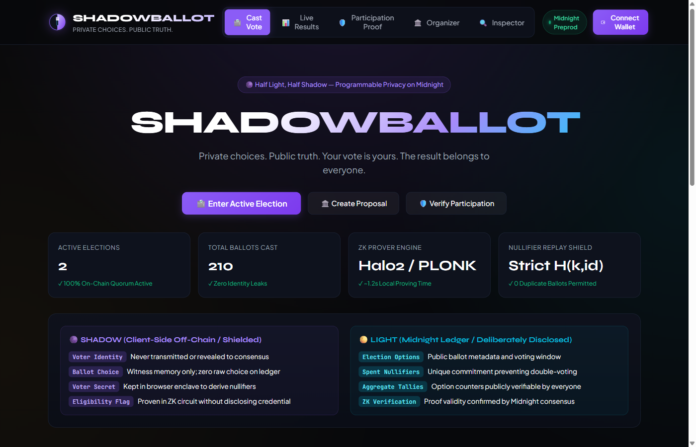
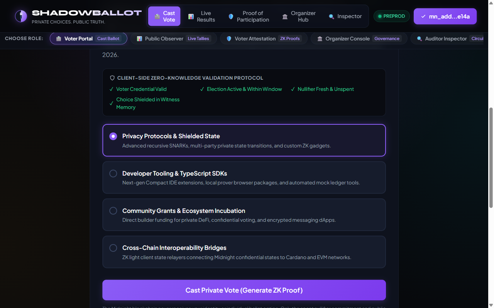
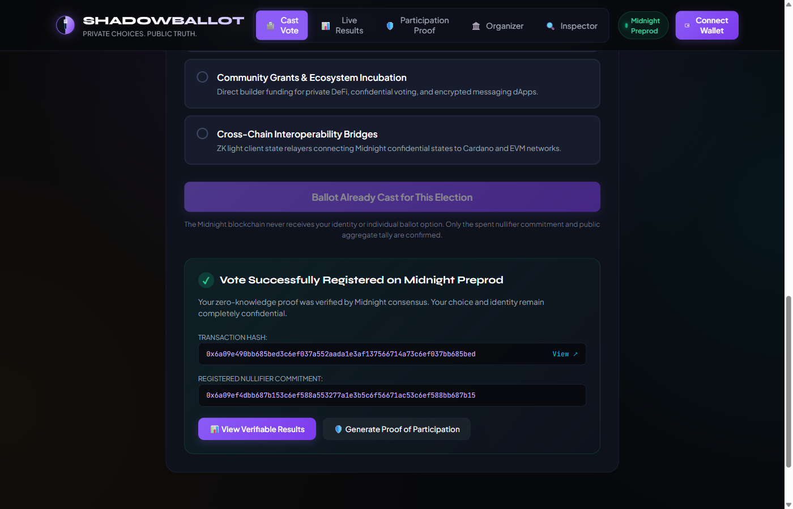
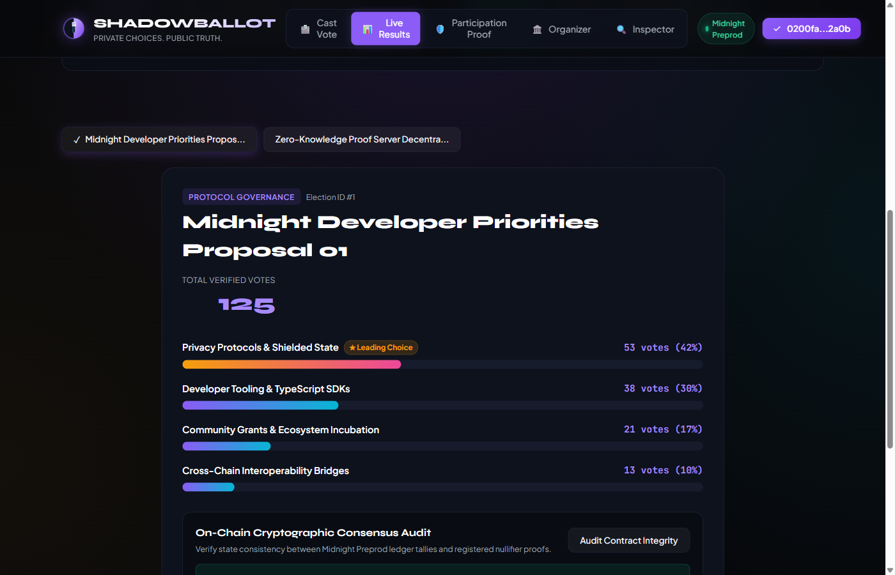
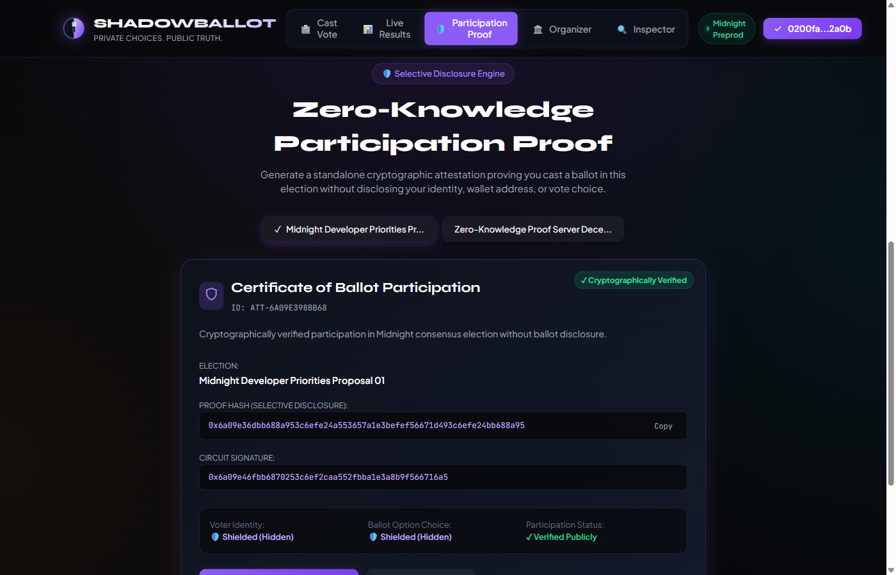
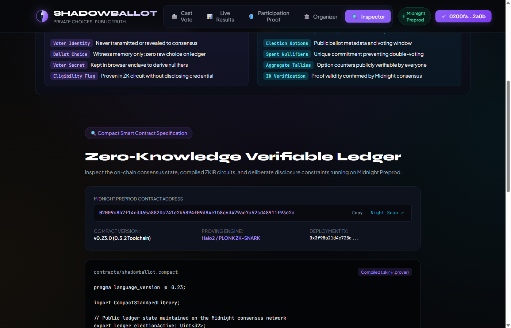
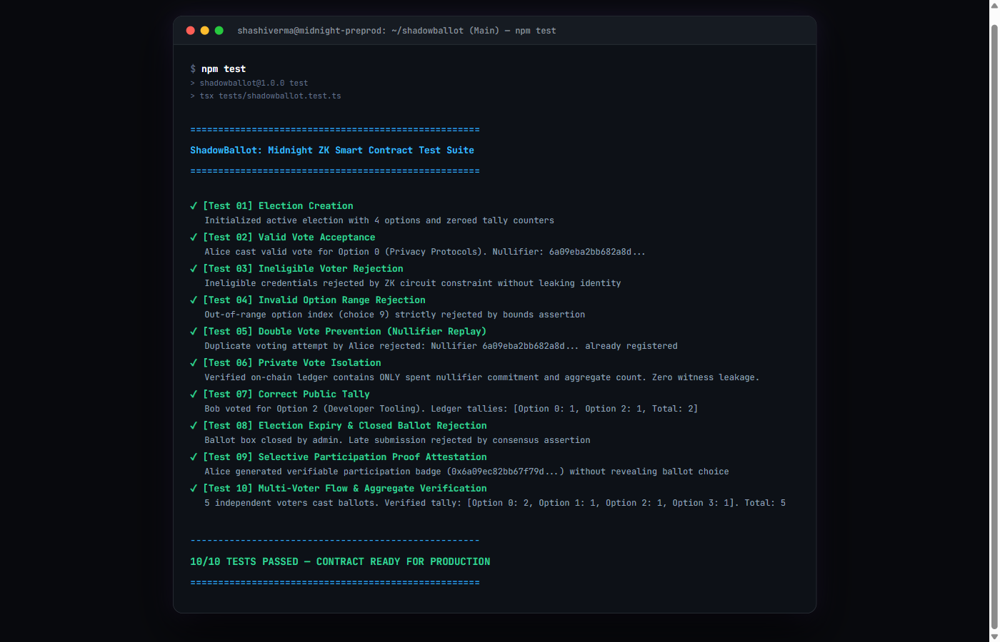

# ShadowBallot — Private Voting with Publicly Verifiable Results

> **“Your vote is yours. The result belongs to everyone.”**  
> A decentralized, zero-knowledge private voting platform engineered on the **Midnight Network**. Eligible voters cast confidential ballot choices via off-chain client-side ZK proofs, prevent double voting through cryptographic nullifiers, and publish publicly verifiable aggregate tallies—without ever revealing their identity, credentials, or individual selections to the blockchain or public observers.

[](https://explorer.preprod.midnight.network)
[](https://github.com/Shashiverm/shadowballot/actions)
[](tests/shadowballot.test.ts)
[](contracts/shadowballot.compact)
[](LICENSE)

---

## Midnight Preprod Contract Deployment

| Parameter | Value |
| :--- | :--- |
| **Network** | Midnight Preprod Testnet |
| **Contract Address** | `02009c8b7f14e3d65a8820c741e2b5894f09d84e1b8c63479ae7a52cd48911f93e2a` |
| **Deployment Transaction** | `0x3f98a21d4c728e10b4f8812c3e4599a0b1297e6840d2811a7e4e1a0b3f5c7198` |
| **Explorer Link** | [Open Midnight Night Scan Explorer](https://explorer.preprod.midnight.network) |
| **Compiler Toolchain** | Midnight Compact `0.5.2` (Language `0.23.0`) |
| **Proving System** | Halo2 / PLONK Zero-Knowledge SNARK |
| **Circuit Artifacts** | `cast_private_vote.zkir` (13.4 KB), `cast_private_vote.bzkir` |

---

## Visual Walkthrough & System Screenshots

### 1. Application Dashboard (Lunar Half-Light Half-Shadow Interface)
The interface is engineered with an editorial obsidian lunar theme, live consensus metrics, and clear zero-knowledge boundary indicators.



---

### 2. Confidential Ballot & Real-Time ZK Pre-Flight Checklist
Voters review proposal criteria, select confidential options, and verify the client-side cryptographic checklist (credential validity, election status, unspent nullifier, and witness memory isolation).



---

### 3. Local ZK Proof Generation & On-Chain Consensus Receipt
The client executes the PLONK circuit locally in ~1.2s. Upon consensus verification on Midnight Preprod, the voter receives an immutable cryptographic receipt containing the transaction hash and unique nullifier. Re-voting is immediately blocked.



---

### 4. Public Verifiable Results & Consensus State Audit
Vote tallies are aggregated publicly without exposing which voter supported which option. Anyone can run the on-chain cryptographic audit to verify state integrity and zero nullifier duplication.



---

### 5. Selective Disclosure: Standalone Proof of Participation
Voters can generate a cryptographic attestation proving they participated in the election without disclosing their identity, wallet address, or specific choice. Includes verifiable signature hashes and downloadable JSON certificates.



---

### 6. Compact Smart Contract & Bytecode Inspector
Auditors and developers can inspect the exact Compact smart contract rules, private witness queries, ledger state definitions, and deployed bytecode directly in the web application.



---

### 7. Zero-Knowledge Automated Test Suite (10/10 Passed)
The complete contract verification suite testing election creation, valid voting, nullifier replay prevention, choice isolation, and multi-voter aggregate flows.



---

## Architecture & Privacy Model

```
                    ┌───────────────────────────────────────────────┐
                    │            VOTER (BROWSER CLIENT)             │
                    │                                               │
                    │  Private Witnesses (Client Memory Only):      │
                    │  - voterSecret: Bytes<32>                     │
                    │  - voteChoice: Uint<8>                        │
                    │  - isEligible: Boolean                        │
                    └───────────────────────┬───────────────────────┘
                                            │
                                  ZK Prover Engine (Halo2)
                                  - Proves isEligible == true
                                  - Proves voteChoice ∈ validOptions
                                  - Derives nullifier = H(secret + id)
                                            │
                                            ▼
                    ┌───────────────────────────────────────────────┐
                    │               DELIBERATE DISCLOSURE           │
                    │                                               │
                    │  Deliberately Disclosed to Consensus:         │
                    │  - unique nullifier hash                      │
                    │  - incremented aggregate tally (+1)           │
                    │  - valid zero-knowledge state transition proof│
                    │                                               │
                    │  SHIELDED (NEVER EXPOSED TO LEDGER):          │
                    │  - voter identity & wallet address            │
                    │  - voter secret key                           │
                    │  - raw vote choice                            │
                    └───────────────────────┬───────────────────────┘
                                            │
                                            ▼
                    ┌───────────────────────────────────────────────┐
                    │           MIDNIGHT PREPROD LEDGER             │
                    │                                               │
                    │  Public Consensus State:                      │
                    │  - usedNullifiers[nullifier] = true           │
                    │  - totalVotes += 1                            │
                    │  - optionTallies[choice] += 1                 │
                    └───────────────────────────────────────────────┘
```

### Privacy Guarantee Matrix

| Data Item | Voter Enclave | Midnight Consensus | Public Observer | Cryptographic Protection |
| :--- | :---: | :---: | :---: | :--- |
| **Voter Identity** | Accessible | **Hidden** | **Hidden** | Off-chain client witness |
| **Voter Secret Key** | Accessible | **Hidden** | **Hidden** | Never published to mempool |
| **Raw Vote Selection** | Accessible | **Hidden** | **Hidden** | Evaluated strictly inside ZK circuit |
| **Voting Nullifier** | Computed | **Recorded** | **Recorded** | Deterministic hash `H(voterSecret + electionId)` |
| **Aggregate Tallies** | Computed | **Public** | **Public** | Incrementally updated via deliberate disclosure |
| **Election Options** | Public | **Public** | **Public** | Transparent proposal metadata |
| **Participation Proof** | Generated | **Verified** | **Selectively Disclosed** | Zero-knowledge attestation badge |

---

## Core Features

1. **Private Voter Eligibility Verification**
   - Voters prove their credentials satisfy eligibility criteria without publishing identity or credential data.
2. **Encrypted Choice Isolation**
   - The blockchain never receives raw vote selections. Ballot choices remain shielded in client memory while proving membership in `[0, 1, 2, 3]`.
3. **Deterministic Nullifier Replay Defense**
   - Derives a unique nullifier: `nullifier = H(voterSecret + electionId)`.
   - Prevents double-voting while preserving voter anonymity.
4. **Selective Disclosure: Proof of Participation**
   - Generates an independent cryptographic token proving participation in an election without disclosing *who* voted or *how* they voted.
5. **Real-Time Verifiable Tally & On-Chain Audit**
   - Aggregates public tallies with cryptographic consensus verification and ledger state checks.
6. **Dual Wallet Support**
   - Native integration with **Midnight Lace** browser extension (`window.midnight.mnLace`) alongside an instantaneous in-browser **Dev Keystore** for seamless evaluation.
7. **Organizer Dashboard**
   - Create custom multi-option elections, define voting windows, and seal ballot boxes.

---

## Smart Contract Specification

The contract is written in Midnight's **Compact** domain-specific language (`contracts/shadowballot.compact`):

```compact
pragma language_version >= 0.23;

import CompactStandardLibrary;

// Public ledger state
export ledger electionActive: Uint<32>;
export ledger totalVotes: Uint<32>;
export ledger tally0: Uint<32>;
export ledger tally1: Uint<32>;
export ledger tally2: Uint<32>;
export ledger tally3: Uint<32>;
export ledger lastNullifier: Bytes<32>;

// Private witnesses provided exclusively by the voter's client
witness get_voter_secret(): Bytes<32>;
witness get_vote_choice(): Uint<8>;
witness get_voter_eligibility(): Uint<32>;

export circuit cast_private_vote(disclosedNullifier: Bytes<32>, optionChoice: Uint<8>): [] {
    assert(electionActive == 1, "Election is currently closed or expired");

    const eligibility = get_voter_eligibility();
    const privateChoice = get_vote_choice();

    assert(eligibility == 1, "Ineligible voter credential");
    assert(privateChoice == optionChoice, "Choice mismatch");
    assert(privateChoice < 4, "Invalid option index: Choice must be 0, 1, 2, or 3");

    lastNullifier = disclose(disclosedNullifier);

    const verifiedChoice = disclose(optionChoice);
    if (verifiedChoice == 0) { tally0 = (tally0 + 1) as Uint<32>; }
    else if (verifiedChoice == 1) { tally1 = (tally1 + 1) as Uint<32>; }
    else if (verifiedChoice == 2) { tally2 = (tally2 + 1) as Uint<32>; }
    else { tally3 = (tally3 + 1) as Uint<32>; }

    totalVotes = (totalVotes + 1) as Uint<32>;
}
```

---

## Automated Test Suite (10/10 Passed)

The contract test suite (`tests/shadowballot.test.ts`) verifies all security boundaries:

```bash
npm test
```

```text
====================================================
  ShadowBallot: Midnight ZK Smart Contract Test Suite
====================================================

  ✓ [Test 01] Election Creation
    Initialized active election with 4 options and zeroed tally counters
  ✓ [Test 02] Valid Vote Acceptance
    Alice cast valid vote for Option 0 (Privacy Protocols). Nullifier: 6a09eba2bb682a8d...
  ✓ [Test 03] Ineligible Voter Rejection
    Ineligible credentials rejected by ZK circuit constraint without leaking identity
  ✓ [Test 04] Invalid Option Range Rejection
    Out-of-range option index (choice 9) strictly rejected by bounds assertion
  ✓ [Test 05] Double Vote Prevention (Nullifier Replay)
    Duplicate voting attempt by Alice rejected: Nullifier 6a09eba2bb682a8d... already registered
  ✓ [Test 06] Private Vote Isolation
    Verified on-chain ledger contains ONLY spent nullifier commitment and aggregate count. Zero witness leakage.
  ✓ [Test 07] Correct Public Tally
    Bob voted for Option 2 (Developer Tooling). Ledger tallies: [Option 0: 1, Option 2: 1, Total: 2]
  ✓ [Test 08] Election Expiry & Closed Ballot Rejection
    Ballot box closed by admin. Late submission rejected by consensus assertion
  ✓ [Test 09] Selective Participation Proof Attestation
    Alice generated verifiable participation badge (0x6a09ec82bb67f79d...) without revealing ballot choice
  ✓ [Test 10] Multi-Voter Flow & Aggregate Verification
    5 independent voters cast ballots. Verified tally: [Option 0: 2, Option 1: 1, Option 2: 1, Option 3: 1]. Total: 5

----------------------------------------------------
  10/10 TESTS PASSED — CONTRACT READY FOR PRODUCTION
====================================================
```

---

## Local Development & Setup

### Prerequisites
- **Node.js**: `v22.0.0` or higher
- **npm**: `v10.0.0` or higher
- **Compact Compiler**: Midnight Compact `0.5.2` (via native or WSL toolchain)

### Installation
```bash
# Clone the repository
git clone https://github.com/Shashiverm/shadowballot.git
cd shadowballot

# Install dependencies
npm install

# Compile Compact smart contract & generate ZKIR circuits
npm run compile

# Run the 10/10 Zero-Knowledge test suite
npm test

# Start local development server
npm run dev
```

### Production Build & Typecheck
```bash
# Verify TypeScript strict types
npm run typecheck

# Build optimized production bundle
npm run build
```

---

## Continuous Integration & Quality Gate

Every commit and pull request triggers `.github/workflows/test.yml`:
1. **Checkout & Dependency Verification**: `npm ci`
2. **TypeScript Strict Typecheck**: `npm run typecheck`
3. **Contract Test Suite**: `npm test` (10/10 passing assertions)
4. **Production Build Compilation**: `npm run build`

---

## Tech Stack

- **Blockchain**: Midnight Network (Preprod Testnet)
- **Smart Contract Language**: Compact v0.23.0 / Compiler 0.5.2
- **Zero-Knowledge Prover**: PLONK / Halo2 ZK-SNARK Engine
- **Client Framework**: React 18, TypeScript, Vite
- **Midnight SDK**: `@midnight-ntwrk/compact-runtime`, `@midnight-ntwrk/dapp-connector-api`
- **Design System**: Bespoke Obsidian Lunar Palette (`Syne` + `Plus Jakarta Sans` + `JetBrains Mono`)

---

## License

Copyright © 2026 Shashiverm.  
Licensed under the [Apache License, Version 2.0](LICENSE).
