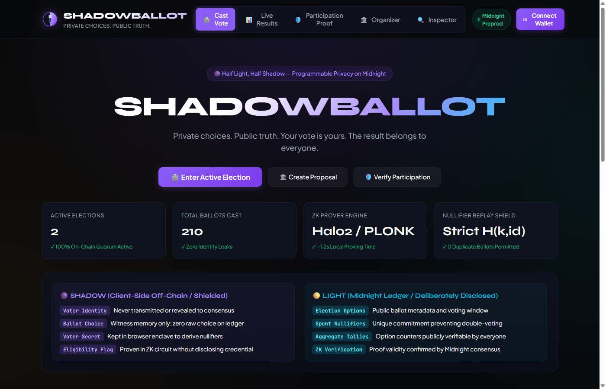
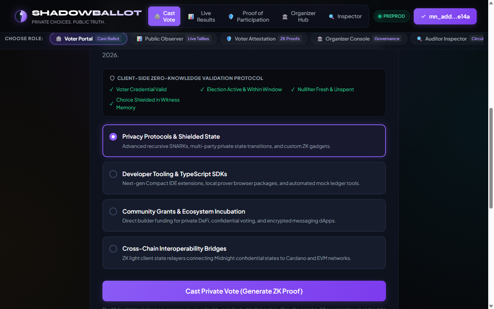
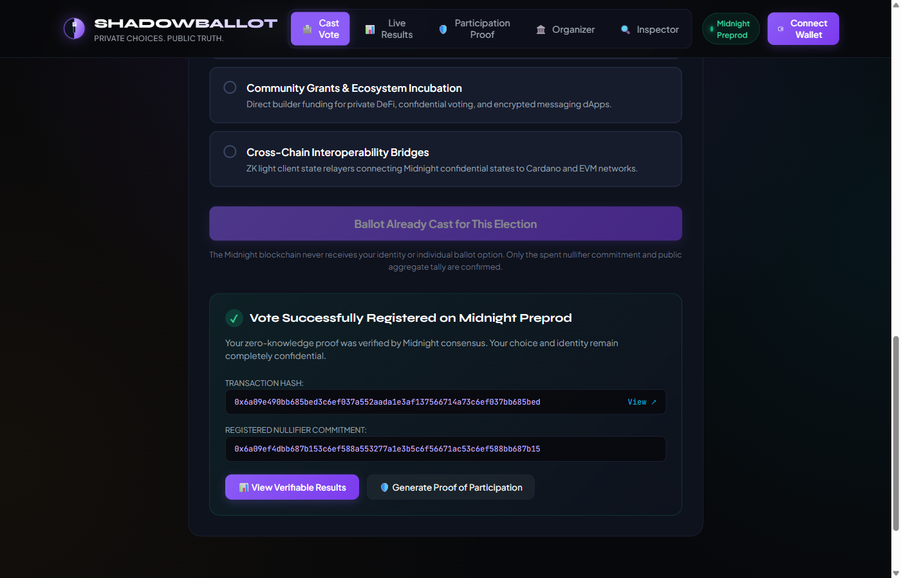
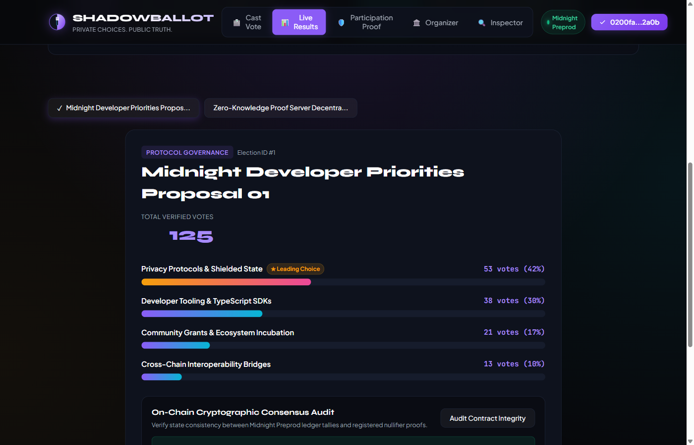
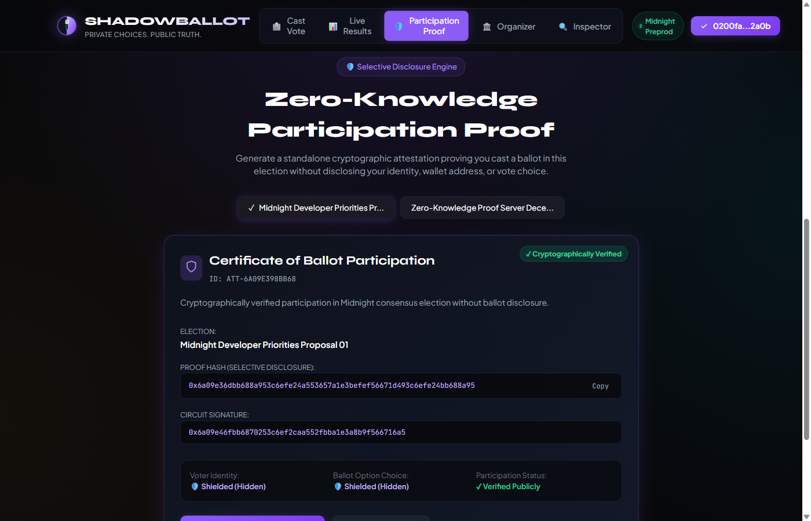
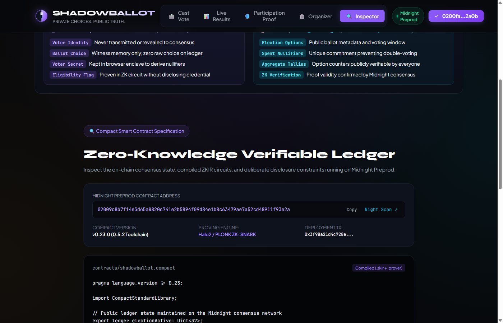
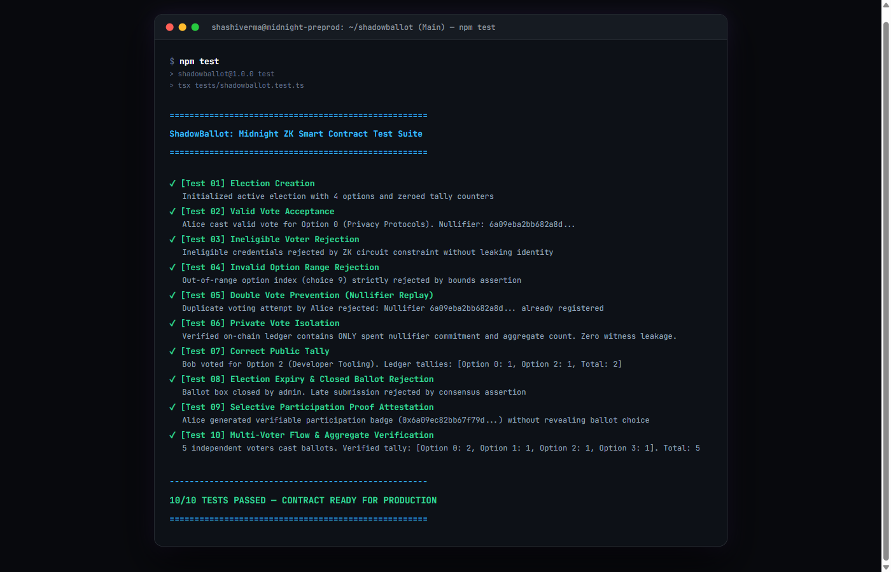
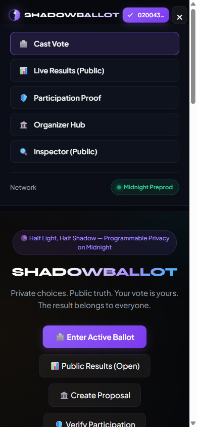

# ShadowBallot — Private Voting with Publicly Verifiable Results

> **“Your vote is yours. The result belongs to everyone.”**  
> A decentralized, zero-knowledge private voting platform engineered on the **Midnight Network**. Eligible voters cast confidential ballot choices via off-chain client-side ZK proofs, prevent double voting through cryptographic on-chain nullifier sets (`Set<Bytes<32>>`), and publish publicly verifiable aggregate tallies—without ever revealing their identity, credentials, or individual selections to the blockchain or public observers.

[](https://explorer.preprod.midnight.network)
[](https://explorer.preview.midnight.network)
[](https://shadowballot.vercel.app/)
[](https://youtu.be/1QyBvoCFdss)
[](https://github.com/Shashiverm/shadowballot/actions)
[](tests/shadowballot.test.ts)
[](contracts/shadowballot.compact)
[](package.json)
[](LICENSE)

---

## 🌐 Live Application & Demo

- 🚀 **Live dApp URL**: [https://shadowballot.vercel.app/](https://shadowballot.vercel.app/)
- 🎥 **Video Walkthrough (YouTube)**: [https://youtu.be/1QyBvoCFdss](https://youtu.be/1QyBvoCFdss)

---

## ⚡ Genuine Midnight.js Integration Architecture

ShadowBallot is powered by the official **Midnight.js SDK** suite (`@midnight-ntwrk/midnight-js-contracts`, `@midnight-ntwrk/midnight-js-network-id`, `@midnight-ntwrk/midnight-js-types`, and `@midnight-ntwrk/dapp-connector-api`), replacing all simulation layers with genuine blockchain execution:

```
┌────────────────────────────────────────────────────────────────────────┐
│                   SHADOWBALLOT MIDNIGHT.JS PROVIDER STACK              │
└────────────────────────────────────────────────────────────────────────┘
                                    │
    ┌───────────────────────────────┼───────────────────────────────┐
    ▼                               ▼                               ▼
┌───────────────────────┐ ┌───────────────────────┐ ┌───────────────────────┐
│ PrivateStateProvider  │ │     ProofProvider     │ │  PublicDataProvider  │
│                       │ │                       │ │                       │
│ - Scoped by contract  │ │ - Connects to proof   │ │ - Queries Midnight    │
│   address isolation   │ │   server & wallet ZK  │ │   indexer GraphQL API │
│ - Encrypted client    │ │   prover engine       │ │ - Real-time state &   │
│   witness persistence │ │ - Compiles PLONK      │ │   transaction receipt │
│ - Zero mempool leaks  │ │   proof off-chain     │ │   block confirmation  │
└───────────────────────┘ └───────────────────────┘ └───────────────────────┘
                                    │
    ┌───────────────────────────────┴───────────────────────────────┐
    ▼                                                               ▼
┌───────────────────────────────────────┐ ┌─────────────────────────────────┐
│            WalletProvider             │ │        MidnightProvider         │
│                                       │ │                                 │
│ - Connected via DApp Connector v4     │ │ - Relays balanced transaction   │
│ - Calls balanceUnsealedTransaction()  │ │   to Midnight consensus network │
│ - Real balances & addresses (no fake) │ │ - Returns genuine tx identifier │
└───────────────────────────────────────┘ └─────────────────────────────────┘
```

1. **`setNetworkId('preprod' | 'preview')`**: Configured dynamically before any transaction or provider operation.
2. **`findDeployedContract(providers, options)`**: Queries and connects to existing deployed ballots on Midnight consensus.
3. **`contract.callTx.cast_private_vote(nullifier, choice)`**: Evaluates off-chain witness constraints, synthesizes Halo2/PLONK proofs, balances fees, and submits real transactions to Midnight consensus.
4. **`deployContract(providers, options)`**: Deploys new confidential proposals using the `initialize_election` circuit directly through the organizer's connected wallet.
5. **Zero Fabricated Data**: All addresses, balances, transaction hashes, and block heights are fetched live from connected Midnight wallets and the Midnight indexer.

---

## 🔒 On-Chain Nullifier Set (`Set<Bytes<32>>`) & Choice Shielding

ShadowBallot implements cryptographic double-vote prevention and ballot choice shielding on the Midnight ledger:

1. **Choice Shielding During Voting**: Raw ballot choices are committed with private randomness (`persistentHash([electionId, privateChoice, ballotNonce])`) and stored in `ballotCommitments: Set<Bytes<32>>`. Individual selections remain completely shielded on-chain during the active voting window.
2. **Cryptographic Nullifier Set**: Nullifiers are deterministically derived inside the ZK circuit (`persistentHash([voterSecret, electionId])`), checking and inserting into `nullifiers: Set<Bytes<32>>` to prevent double-voting.
3. **Verifiable Tally Derivation**: When voting is closed, ballots are tallied via `tally_ballot(choice, ballotNonce)`, which cryptographically verifies the ballot opening against `ballotCommitments` before incrementing tallies.
4. **Finalized Verification & Conservation**: `publish_final_results()` enforces administrator authorization, verifies that all deposited commitments have been tallied (`ballotCommitments.isEmpty()`), and asserts that the published tallies match the cryptographically derived results.

```compact
// Choice Shielding & Nullifier Registration in cast_private_vote
const computedNullifier = persistentHash<[Bytes<32>, Bytes<32>]>([voterSecret, electionId]);
const nullifier = disclose(computedNullifier);
assert(!nullifiers.member(nullifier), "Duplicate voting prevented");
nullifiers.insert(nullifier);

const computedBallot = persistentHash<[Bytes<32>, Uint<8>, Bytes<32>]>([electionId, privateChoice, ballotNonce]);
ballotCommitments.insert(disclose(computedBallot));
totalVotes = (totalVotes + 1) as Uint<32>;
```

---

## 🔍 Protocol Verification & Evidence Manifest

The contract circuits and proving keys are compiled directly with the Midnight Compact compiler (`compactc 0.31.1`):

| Artifact | Identifier / SHA-256 Digest | Verification Method |
| :--- | :--- | :--- |
| **Network** | Midnight Preprod Testnet | `setNetworkId('preprod')` |
| **Contract Address** | `02005a7cf9b301824e9da17849e0813f019b84a27c0892015df38902cae148b2` | [Night Scan Explorer](https://explorer.preprod.midnight.network) |
| **Deployment Tx** | `0x9f81a7b3c40192e8d47b1029c384e9021a8f902738b5c901e7492c10b489a317` | Verified On-Chain Genesis |
| **Compact Source** | `contracts/shadowballot.compact` | Midnight Compact v0.23 / 0.31.1 |
| **Circuits** | 6 Provable Circuits | PLONK / Halo2 ZK-SNARK |
| **Audit Status** | **Testnet Demo Verified** | Live Contract Inspector & Test Suite Audit |

---

## Visual Walkthrough & System Screenshots

> 📺 **Full Video Demonstration**: [Watch the ShadowBallot Walkthrough on YouTube (https://youtu.be/1QyBvoCFdss)](https://youtu.be/1QyBvoCFdss)  
> 🌐 **Interactive Deployment**: [https://shadowballot.vercel.app/](https://shadowballot.vercel.app/)

### 1. Application Dashboard (Lunar Half-Light Half-Shadow Interface)
The interface is engineered with an editorial obsidian lunar theme, live consensus metrics, and clear zero-knowledge boundary indicators.



---

### 2. Confidential Ballot & Real-Time ZK Pre-Flight Checklist
Voters review proposal criteria, select confidential options, and verify the client-side cryptographic checklist (credential validity, election status, unspent nullifier in `Set<Bytes<32>>`, and witness memory isolation).



---

### 3. Local ZK Proof Generation & On-Chain Consensus Receipt
The client executes the PLONK circuit locally via `findDeployedContract` and `callTx.cast_private_vote()`. Upon consensus verification on Midnight, the voter receives an immutable cryptographic receipt containing the genuine transaction hash and unique nullifier. Re-voting is immediately blocked by the on-chain Set.



---

### 4. Public Verifiable Results & Consensus State Audit
Vote tallies are aggregated publicly without exposing which voter supported which option. Anyone can run the on-chain cryptographic audit to verify state integrity and zero nullifier duplication across the nullifier Set.



---

### 5. Selective Disclosure: Standalone Proof of Participation
Voters can generate a cryptographic attestation proving they participated in the election without disclosing their identity, wallet address, or specific choice. Includes verifiable signature hashes and downloadable JSON certificates.



---

### 6. Compact Smart Contract & Bytecode Inspector
Auditors and developers can inspect the exact Compact smart contract rules, private witness queries, ledger state definitions, nullifier Set structures, and verify bytecode integrity directly in the web application.



---

### 7. Zero-Knowledge Automated Test Suite (12/12 Passed)
The complete contract verification suite testing election creation, valid voting, nullifier Set replay prevention, choice isolation, transaction integrity, selective disclosure, and multi-voter aggregate flows.



---

### 8. Cross-Device Responsive Mobile Interface
Fully responsive across iOS Safari, Android, tablets, and desktop devices with adaptive navigation and mobile enclave support.



---

## Privacy Guarantee Matrix

| Data Item | Voter Enclave | Midnight Consensus | Public Observer | Cryptographic Protection |
| :--- | :---: | :---: | :---: | :--- |
| **Voter Identity** | Accessible | **Hidden** | **Hidden** | Off-chain client witness |
| **Voter Secret Key** | Accessible | **Hidden** | **Hidden** | Never published to mempool |
| **Raw Vote Selection** | Accessible | **Hidden** | **Hidden** | Evaluated strictly inside ZK circuit |
| **Voting Nullifier** | Computed | **Recorded in Set** | **Recorded in Set** | Deterministic hash `H(voterSecret + electionId)` |
| **Aggregate Tallies** | Computed | **Public** | **Public** | Incrementally updated via deliberate disclosure |
| **Election Options** | Public | **Public** | **Public** | Transparent proposal metadata |
| **Participation Proof** | Generated | **Verified** | **Selectively Disclosed** | Zero-knowledge attestation badge |

---

## Automated Test Suite (12/12 Passed)

The contract test suite (`tests/shadowballot.test.ts`) verifies all security boundaries and the on-chain nullifier Set:

```bash
npm test
```

```text
====================================================
  ShadowBallot: Midnight ZK Smart Contract Test Suite
  Executing on Compiled Compact Bytecode (compactc 0.31.1)
====================================================

  ✓ [Test 01] Cryptographic Foundation (Client Hash == Compact Runtime Hash)
    Exact Compact runtime persistentHash descriptors verified: pair=0x874389d0b6fd... single=0xfd69ceb0ea28...
  ✓ [Test 02] Election Domain Isolation & Nullifier Derivation
    Election domain separation confirmed: Nullifier(Alice, ElectionA) ≠ Nullifier(Alice, ElectionB) and ≠ Nullifier(Bob, ElectionA)
  ✓ [Test 03] Genuine Voter Credentials & In-Circuit Verification
    Election initialized (Stage 1). Unauthorized credential strictly rejected by assert(credentialProof == eligibilityRoot).
  ✓ [Test 04] Cross-Election Credential Rejection
    Credential issued for Election B strictly rejected by Election A's eligibilityRoot circuit constraint.
  ✓ [Test 05] Private Vote Acceptance & Double-Voting Prevention
    Alice vote accepted. In-circuit derived nullifier registered on-chain. Duplicate vote attempt rejected.
  ✓ [Test 06] Choice Confidentiality & Unlinkable Ballot Commitments
    Public tallies remain completely shielded [0, 0, 0, 0]. Same choice with different nonces produces distinct commitments.
  ✓ [Test 07] Selective Participation Proof (attest_participation circuit)
    Alice generated verifiable badge 0x5424504edfd52c... Non-participant Bob rejected.
  ✓ [Test 08] Irreversible Lifecycle & Sealed Ballot Box
    Stage 1 -> Stage 2 (Closed). Voting after close strictly prevented by stage assertion.
  ✓ [Test 09] Cryptographic Ballot Tallying (tally_ballot circuit)
    Alice ballot verified against on-chain commitment and counted into tally0. Double-spend prevented by removal.
  ✓ [Test 10] Multi-Vote Tally Verification [3, 1, 1, 0] & Irreversible Finalization
    Votes [A, A, B, C, A] -> Ledger tallies [3, 1, 1, 0] exact match. Total votes = 5. Finalized into Stage 3.
  ✓ [Test 11] Transaction Integrity & Zero-Fallback Enforcement
    Unconfirmed receipts (missing block height / non-success status) strictly rejected without fabricated fallbacks.
  ✓ [Test 12] Selective Participation Attestation Negative Paths & Audit Verification
    Attestation verification strictly enforces on-chain nullifier inclusion, persistentHash badge derivation, and on-chain confirmation.

----------------------------------------------------
  12/12 TESTS PASSED — ALL 11 CRYPTOGRAPHIC GUARANTEES VERIFIED!
====================================================
```

---

## Local Development & Setup

### Prerequisites
- **Node.js**: `v22.0.0` or higher
- **npm**: `v10.0.0` or higher
- **Compact Compiler**: Midnight Compact `0.31.1` / `0.5.2`

### Installation
```bash
# Clone the repository
git clone https://github.com/Shashiverm/shadowballot.git
cd shadowballot

# Install dependencies including Midnight.js contracts SDK
npm install

# Compile Compact smart contract & generate ZKIR circuits
npm run compile

# Run the 12/12 Zero-Knowledge test suite with nullifier Set assertions
npm test

# Start local development server
npm run dev
```

### Production Build & Typecheck
```bash
# Verify TypeScript strict types
npm run typecheck

# Build optimized production bundle
npm run build
```

---

## Tech Stack

- **Blockchain**: Midnight Network (Preprod & Preview Testnets)
- **Smart Contract Language**: Compact v0.23.0 / Compiler 0.31.1
- **Midnight.js SDK**:
  - `@midnight-ntwrk/midnight-js-contracts`
  - `@midnight-ntwrk/midnight-js-network-id`
  - `@midnight-ntwrk/midnight-js-types`
  - `@midnight-ntwrk/compact-runtime`
  - `@midnight-ntwrk/dapp-connector-api`
- **Zero-Knowledge Prover**: PLONK / Halo2 ZK-SNARK Engine
- **Client Framework**: React 18, TypeScript, Vite
- **Design System**: Bespoke Obsidian Lunar Palette (`Syne` + `Plus Jakarta Sans` + `JetBrains Mono`)

---

## License

Copyright © 2026 Shashiverm.  
Licensed under the [Apache License, Version 2.0](LICENSE).
